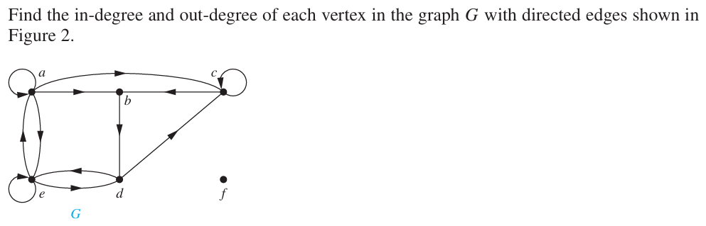

# Tree
A tree is a unidirectional graph with no simple circuits.
> [!Tip]
> "NO simple Circuit" means there is no way to start at one vertex and following the edges to reach the same vertex.

$G_1$ and $G_2$ are trees but $G_3$ and $G_4$ are not.
- $G_3$ has a circuit or loop $a,b,e,d$.
- $G_4$ is not full connected.
